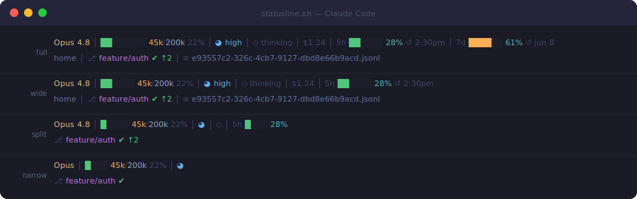

# claude-code-statusline

A two-line status bar for [Claude Code](https://claude.ai/code) that actually tells you what's going on.



> **Fork note:** this is a fork of [isaacaudet/claude-code-statusline](https://github.com/isaacaudet/claude-code-statusline)
> that splits the bar across two lines, adds a reasoning-**effort** indicator, and makes the
> transcript filename a clickable link. See [Credits](#credits).

---

## What it shows

```
Opus 4.8  │  ████░░░░ 45k/200k 22%  │  ◕ high  │  ◇ thinking  │  $1.24  │  5h ██░░░░ 28% ↺ 2:30pm  │  7d ████░░ 61% ↺ jun 8
nas  │  ⎇ feature/auth ✔ ↑2  │  ≡ e93557c2-…-6kQbB.jsonl
```

**Line 1 — session state**

| Section | What it means |
|---------|--------------|
| `Opus 4.8` | Current model — amber for Opus, blue for Sonnet, cyan for Haiku |
| `████░░░░ 45k/200k 22%` | Context window usage bar |
| `◕ high` | Reasoning effort — fill scales with level (see below) |
| `◇ thinking` | Extended thinking mode status |
| `$1.24` | Running session cost |
| `5h ██░░ 28% ↺ 2:30pm` | 5-hour rate limit bar with reset time |
| `7d ████░░ 61% ↺ jun 8` | 7-day rate limit bar with reset date |

**Line 2 — location & context**

| Section | What it means |
|---------|--------------|
| `home` | Current working directory |
| `⎇ feature/auth` | Git branch in the current working directory |
| `✔` / `✗` | Clean or dirty working tree |
| `↑2 ↓1` | Commits ahead / behind upstream (hidden when zero) |
| `≡ …jsonl` | Transcript filename — a clickable `file://` link that opens the transcript |

---

## Reasoning effort

The effort indicator reads the live `effort.level` from Claude Code's status JSON (reflecting mid-session
`/effort` changes). Its fill scales with the level, so it reads at a glance even when collapsed to an icon:

| Level | Icon | Color |
|-------|------|-------|
| low | `◔` | green |
| medium | `◑` | cyan |
| high | `◕` | blue |
| xhigh | `●` | magenta |
| max | `●` | amber |

In wider terminals it shows the icon plus the level word (`◕ high`); in tighter ones it collapses to the
icon alone, mirroring how the thinking indicator collapses to `◆`/`◇`. The segment is hidden entirely when
the current model doesn't support the effort parameter.

---

## Install

```bash
# 1. Download
curl -o ~/.claude/statusline.sh \
  https://raw.githubusercontent.com/esnith/claude-code-statusline/main/statusline.sh
chmod +x ~/.claude/statusline.sh
```

```jsonc
// 2. Add to ~/.claude/settings.json
{
  "statusLine": {
    "type": "command",
    "command": "~/.claude/statusline.sh"
  }
}
```

Restart Claude Code. That's it.

---

## Terminal width

The script detects your terminal width automatically via `stty`. It adapts what it shows based on available
space — wider terminals get more sections, narrower terminals stay compact and never wrap.

| Width | Line 1 | Line 2 |
|-------|--------|--------|
| ≥ 150 | tokens, effort + word, thinking label, cost, 5h + 7d bars | cwd, branch, ↑↓, transcript link |
| 100–149 | tokens, effort + word, thinking label, cost, 5h bar | cwd, branch, ↑↓, transcript link |
| 76–99 | tokens, effort icon, thinking symbol, 5h bar | branch, ↑↓ |
| < 76 | short model name, tokens, effort icon | branch |

If auto-detection doesn't work in your terminal (Claude Code often runs the script with no TTY, so it
defaults to the compact tier), pass `TERM_WIDTH` directly:

```jsonc
{
  "statusLine": {
    "type": "command",
    "command": "TERM_WIDTH=160 ~/.claude/statusline.sh"
  }
}
```

---

## Configuration

Edit the flags at the top of `statusline.sh`:

```bash
SHOW_GIT=true           # branch, dirty, ahead/behind
SHOW_TOKENS=true        # context window bar
SHOW_EFFORT=true        # reasoning-effort indicator
SHOW_THINKING=true      # extended thinking indicator
SHOW_RATE_LIMITS=true   # 5h / 7d usage bars
SHOW_CWD=true           # current directory (line 2)
SHOW_TRANSCRIPT=true    # clickable transcript filename (line 2)
BRANCH_MAX_LEN=28       # truncate branch names beyond this
GIT_CACHE_SECS=10       # how long to cache git status per repo
TOKEN_BAR_WIDTH=8       # bar width in full-screen mode
```

---

## Rate limits

Rate limit data (5h / 7d bars) is fetched from the Anthropic API using your Claude Code OAuth token, which is
read automatically from the macOS Keychain or `~/.claude/.credentials.json` on Linux. Results are cached for
**1 hour** to minimize requests. If the API returns an error (e.g. rate limited), the cache is not
overwritten — stale good data is shown instead.

Requires a Pro or Max subscription. Set `SHOW_RATE_LIMITS=false` to disable.

---

## Requirements

- `jq` — `brew install jq`
- `curl` — already on macOS/Linux
- A terminal that supports [OSC 8 hyperlinks](https://gist.github.com/egmontkob/eb114294efbcd5adb1944c9f3cb5feda)
  for the clickable transcript link (iTerm2, WezTerm, Kitty, VS Code, GNOME Terminal). The filename still
  displays in terminals without support — it just isn't clickable.
- Claude Code Pro or Max (for rate limit data)

---

## Credits

Based on [daniel3303/ClaudeCodeStatusLine](https://github.com/daniel3303/ClaudeCodeStatusLine), by way of
[isaacaudet/claude-code-statusline](https://github.com/isaacaudet/claude-code-statusline).

isaacaudet added: git branch/dirty/ahead-behind, token bar, session cost, adaptive width tiers, git caching,
model color, block-style bars.

This fork added: two-line layout, reasoning-effort indicator, and a clickable `file://` transcript link.

MIT License
